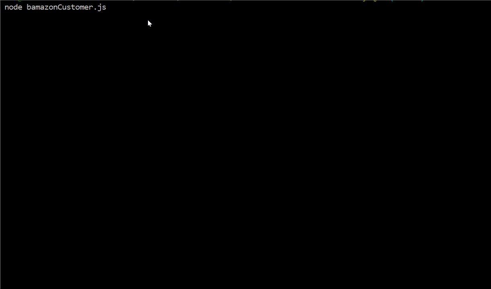

# BAMAZON
Amazon-like storefront with MySQL. The app will take in orders from customers and deplete stock from the store's inventory.

### Prerequisites
Things you need to install:

1. Node.js
2. mySQL
3. [inquirer](https://www.npmjs.com/package/inquirer)
4.  [mysql](https://www.npmjs.com/package/mysql#performing-queries)

Format: 

Format: 
